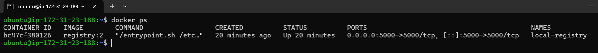
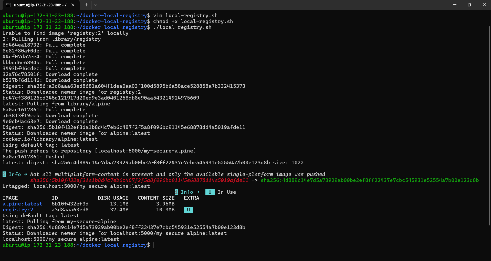

# Docker Local Registry Setup

This project demonstrates how to create and use a local Docker Registry on an AWS Ubuntu EC2 instance.

The workflow includes:

- Running a local Docker Registry container
- Pulling Docker images from Docker Hub
- Tagging images for local registry usage
- Pushing images into the local registry
- Removing local images
- Pulling images back from the local registry

---

# Project Architecture

```text
Docker Hub
    ↓
Pull alpine image
    ↓
Local Docker Host
    ↓
Tag image
    ↓
Local Docker Registry (localhost:5000)
    ↓
Push image
    ↓
Delete local image
    ↓
Pull image again from local registry
```

---

# Project Structure

```text
docker-local-registry/
│
├── screenshots/
│   ├── registry-running.png
|   ├── local-registry-script.png
|   ├── full-script-output.png
│
├── local-registry.sh
│
├── README.md
|
├── .gitignore

```

---

# Prerequisites

Before running this project, make sure the following are installed:

- Docker
- Git
- Ubuntu EC2 Instance (or any Linux machine)

---

# Step 1 - Start Local Docker Registry

Run the following command to start a local Docker Registry container:

```bash
docker run -dt \
--name local-registry \
-p 5000:5000 \
registry:2
```

This creates a Docker Registry running on port `5000`.

---

# Step 2 - Pull Alpine Image from Docker Hub

```bash
docker pull alpine:latest
```

This downloads the Alpine Linux image from Docker Hub.

---

# Step 3 - Tag Image for Local Registry

```bash
docker tag alpine:latest localhost:5000/my-secure-alpine:latest
```

This retags the image so it can be pushed into the local registry.

---

# Step 4 - Push Image to Local Registry

```bash
docker push localhost:5000/my-secure-alpine:latest
```

This uploads the image into the local Docker Registry.

---

# Step 5 - Remove Local Images

```bash
docker rmi localhost:5000/my-secure-alpine:latest

docker rmi alpine:latest
```

This removes local copies of the image to verify that the registry stores the image successfully.

---

# Step 6 - Verify Images Removed

```bash
docker images
```

This checks whether the image was removed locally.

---

# Step 7 - Pull Image from Local Registry

```bash
docker pull localhost:5000/my-secure-alpine:latest
```

This pulls the image back from the local Docker Registry.

---

# Verify Registry Container

```bash
docker ps
```

You should see the `registry:2` container running.

---
# Example Screenshot Sections

## Local Registry Running



---

## Full Script Execution Output



---

# Script File

The project includes the following automation script:

```bash
local-registry.sh
```

This script automates:

- Registry creation
- Image pull
- Image tagging
- Image push
- Image deletion
- Image re-pull

---

# Important Notes

- This project uses a local development registry.
- The registry currently runs without HTTPS or authentication.
- This setup is intended for learning and testing purposes only.

---

# Clone Repository

```bash
git clone https://github.com/manojselvang/docker-local-registry
```

---

# Run Script

```bash
chmod +x local-registry.sh

./local-registry.sh
```

---

# Author

Manoj Selvan

